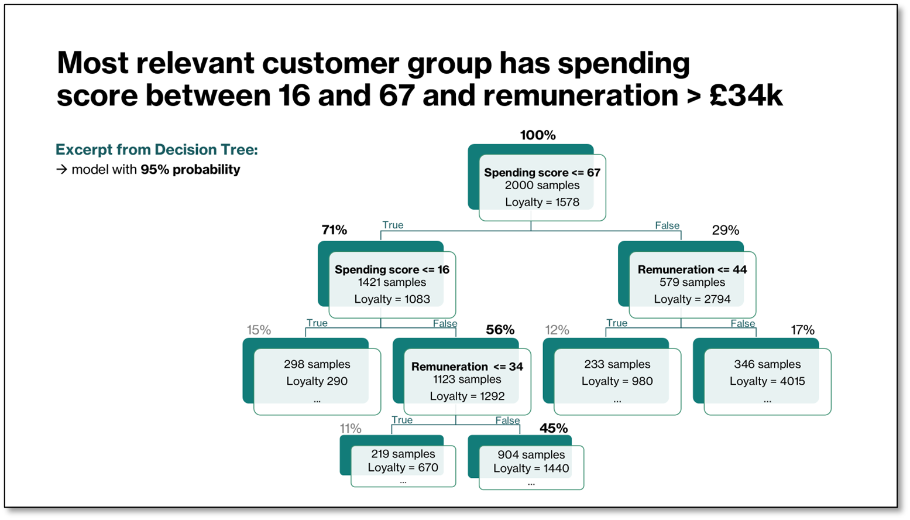
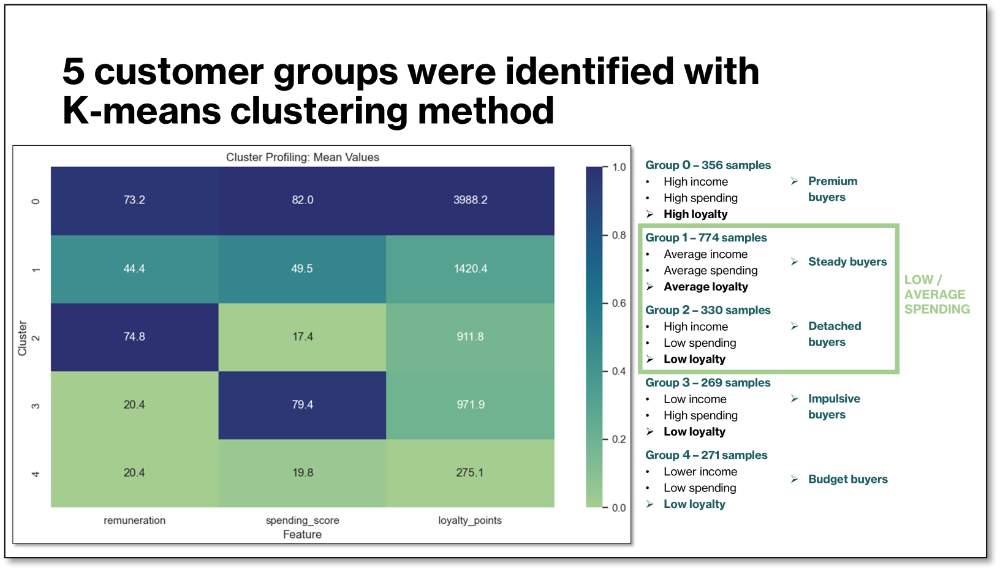
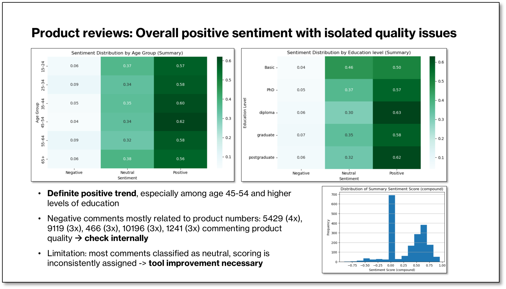

<p align="center">
  
</p>

<h1 align="center">Customer Loyalty & Behaviour Analysis</h1>

---

## 📚 Table of Contents
- [Overview](#-overview)
- [Business Problem](#-business-problem)
- [Key Questions](#-key-questions)
- [Methods & Techniques](#-methods--techniques)
- [Key Findings](#-key-findings)
- [Recommendations](#-recommendations-one-concrete-action-per-segment)
- [Repository Structure](#-repository-structure)

---

## 📝 Overview  
This project analyses customer behaviour and loyalty patterns for Turtle Games, a global retailer of books, board games, video games, and toys. Using exploratory analysis, predictive modelling, and clustering, the goal is to understand what drives loyalty and identify actionable strategies to improve customer retention and spending.  
  
**Dataset:** 2,000 customer records including demographics, spending behaviour, loyalty points, and text reviews.

## ⚡ Business Problem  
Turtle Games aims to improve overall sales performance by understanding how customers accumulate loyalty points, which customer groups offer the highest potential for growth, and how customer sentiment can inform product and marketing decisions.

## 🔎 Key Questions  
- Which customer characteristics predict loyalty?  
- How do spending score and remuneration influence loyalty?  
- What customer segments exist, and how should each be targeted?  
- What insights can be extracted from customer reviews?

## 🧪 Methods & Techniques  
- Exploratory Data Analysis (EDA)  
- Multiple Linear Regression  
- Decision Trees  
- K‑Means Clustering  
- Sentiment Analysis (NLP)  
- Data visualisation and statistical profiling

## 📊 Key Findings  
- **Spending score and remuneration** are the strongest predictors of loyalty.
  
- From **Five customer segments** identified, **Detached Buyers (17%) and Steady Buyers (39%) show the largest improvement potential**.
  
- Sentiment analysis reveals mostly positive reviews, with negative comments focused on **product quality issues**.
  

## ⭐ Recommendations

Since spending and remuneration are the two key drivers of loyalty, and only spending is influenceable,  
the recommendations focus on increasing customer spending per segment (ordered by priority):

#### ⭐ Detached Buyers (17%) — Goal: Re‑engage  
**Profile:** High income (~75k) • Very low spending (~17) • Low loyalty (~912)  
**Action:** Offer an **Exclusive Preview Offer** (premium samples or early access) to re‑engage high‑income customers and convert them into active spenders.

#### ⭐ Steady Buyers (39%) — Goal: Upsell  
**Profile:** Average income (~44k) • Average spending (~50) • Average loyalty (~1420)  
**Action:** Use **personalised product recommendations** to increase basket size among customers who already buy regularly.

#### ⭐ Premium Buyers (18%) — Goal: Retain  
**Profile:** High income (~73k) • High spending (~82) • Very high loyalty (~3988)  
**Action:** Maintain loyalty with a **VIP Early Access Pass** for new releases to reinforce their premium status.

#### ⭐ Budget Buyers (14%) — Goal: Maintain at Low Cost  
**Profile:** Low income (~20k) • Low spending (~20) • Very low loyalty (~275)  
**Action:** Use **automated seasonal discounts** only — maintain engagement without investing in targeted campaigns.

#### ⭐ Impulsive Buyers (13%) — Goal: Stabilise  
**Profile:** Low income (~20k) • High spending (~79) • Low loyalty (~972)  
**Action:** Introduce a **delayed reward** (e.g., “Buy 2, Get 1 next month”) to encourage more consistent purchasing behaviour.

---

#### ⭐ Additional Insight: Customer Sentiment — Goal: Investigate Potential Quality Issues 
**Context:** Though sentiment is predominantly positive, negative reviews cluster around specific product IDs (5429, 9119, 466, 10196, 1241).    
**Action:** Review the quality concerns internally and refine NLP tools to improve sentiment classification.

---

## 📁 Repository Structure  
```
P1_Turtle_Games/
│
├── 00_Assets/          # Visuals
├── 01_Data/            # Clean dataset
├── 02_Notebooks/       # EDA, modelling, segmentation notebooks
├── 03_Reports/         # Final report, presentation
└── README.md           # Project overview (this file)
```
[View the repository](https://github.com/DA-mia/P1_Turtle_Games)

---

<div align="right">

🔙 [Back to my Data Analytics Portfolio](https://github.com/DA-mia/data-analytics-portfolio)

</div>
